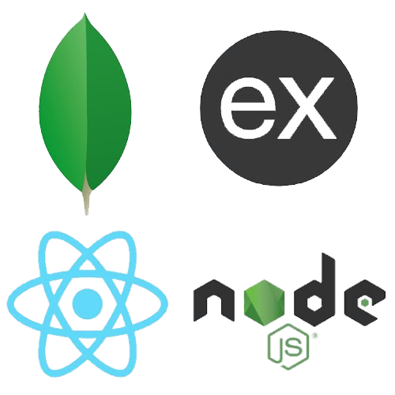
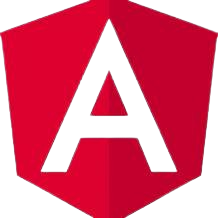

<body style="background-color:black;">

<h1 align="center"> 👋 Hello, World! I'm Ali Aman Khan </h1>

<b>In the kingdom of code, I am the architect of logic, the sorcerer of syntax, and the explorer of infinite possibilities. A Software Developer, passionate about Game Development, and learning new things. Array of interests: AI, ML, and endless curiosity.</b>
  

 
🌟 Learner of the new world!  
❄️ B.Tech in **Computer Science Engineering** from **GECJ**  
🤓 Currently Improving **Backend Development**  
💪 Always eager to **Improve** more  
🚀 Make Projects in my free time  
📚 dedicated learner, ❤️ to take on new **challenges**.  
👯 I’m looking to **collaborate**
  
 
  ### 📫 Connect with me:

&nbsp;&nbsp;

&nbsp;&nbsp;

 &nbsp;&nbsp;

 
 
  
 ### Languages and Tools
 

  
 &nbsp;&nbsp;
 &nbsp;&nbsp;
 &nbsp;&nbsp;
 &nbsp;&nbsp;
 &nbsp;&nbsp;
  &nbsp;&nbsp;
 &nbsp;&nbsp;
 &nbsp;&nbsp;
 &nbsp;&nbsp;
 &nbsp;&nbsp;
 &nbsp;&nbsp;
 &nbsp;&nbsp;
 &nbsp;&nbsp;
 &nbsp;&nbsp;
 &nbsp;&nbsp;
 &nbsp;&nbsp;
  
 
 

 

<!-- 
 -->
  
<h3>GitHub Stats</h3>

  

    
    
    
**I code because I can 💻, I dream because I will ✨, and I debug because I must 🐞.**

  

<!-- 
 -->

<!-- ### Visit  -->

<!-- 

 
**Visitors Count**  
 -->

<!-- 
 -->

#### That's a wrap! Thanks for scrolling through my code journey. Feel free to reach out for collaborations, discussions, or just to geek out about the wonders of technology. Happy coding!
 
 </body>
